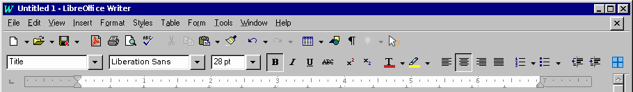

# Readme for Chicago95 LibreOffice icon theme

This is a highly experimental icon set for LibreOffice to use that will provide a vintage Microsoft Word 95 look and feel. It is only very loosely related to the official [Chicago95](https://github.com/grassmunk/Chicago95) project which is a more comprehensive project for the entire desktop experience.

Note: This is not a 100% complete icon theme. It will mostly affect toolbar icons which are most often seen.

## Upstream
[https://gitlab.com/bgstack15/libreoffice-chicago95-iconset.git](https://gitlab.com/bgstack15/libreoffice-chicago95-iconset.git) is the original location of this package.

## Author
bgstack15 on irc.freenode.net or gmail.

## Alternatives
Any other icon theme for LibreOffice 6 or higher. Try Colibre, the built-in one. Or [Tango](https://extensions.libreoffice.org/en/extensions/show/tango-icon-theme-for-libreoffice), the original default iconset. Or the nifty [Office2013](https://www.deviantart.com/charliecnr/art/Office-2013-theme-for-LibreOffice-512127527) one.
No works have been found for a theme of this exact nature.

## Dependencies
* 7za (p7zip)
* coreutils

## Building this project
The goal is to provide a .oxt file suitable for being a [LibreOffice extension](http://dcjtech.info/topic/creating-libreoffice-extensions/). 7za doesn't make the right kind of zip file, so maybe zip will. But you can also just plop the `images_chicago95.zip` file to `/usr/lib64/libreoffice/share/config/` directly.

To assemble the `images_chicago95.zip` file and also the .oxt file, manually inspect and run build.sh.

    ./build.sh

To place the iconset in the public location for a 64-bit Linux distro:

    sudo cp -p Chicago95-theme/iconsets/images_chicago95.zip /usr/lib64/libreoffice/share/config/

## Workflow for adding to project

* Screenscrapes of original assets when available, which are scarce. Office suites in the 90s just didn't do as much as they do now. 
* Hand-creating new images when necessary, using the original color palette available as file [iconsets/c95/sources/palette.png](iconsets/c95/sources/palette.png) in this repo.

## Sources
MS Office 95 Pro, original disc.
Original artwork.

## Improve
Only a rudimentary LibreOffice Writer initial screen has full icon support: the two main toolbars, and the "draw" toolbar.

Contributions are welcome!

Possible future goals include:
* Initial screen of LibreOffice Calc looks like an Excel 95 experience
* Initial screen of each LibreOffice app looks like its Office 95 equivalent
* Each popup/toolbar available from the initial toolbars in Writer are themed correctly
* Each popup/toolbar available from the initial toolbars in Calc are themed correctly
* A proper .oxt file is built for easy installation, particularly through the application itself in menu Tools -> Extension Manager....
* Transparency is set properly on assets

## References

* [https://jrsoftware.org/download.php/tb97.zip](https://jrsoftware.org/download.php/tb97.zip) Some similar icons, but not good enough for Word 95 equivalence.
* [/usr/lib64/libreoffice/share/config/images_colibre.zip](file:///usr/lib64/libreoffice/share/config/images_colibre.zip) Colibre icon theme installed with LibreOffice.
