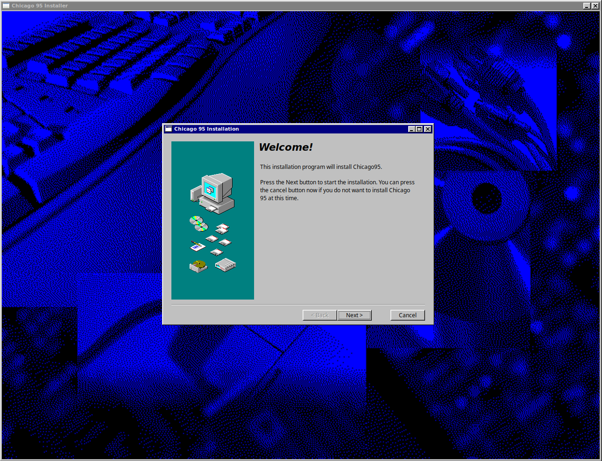
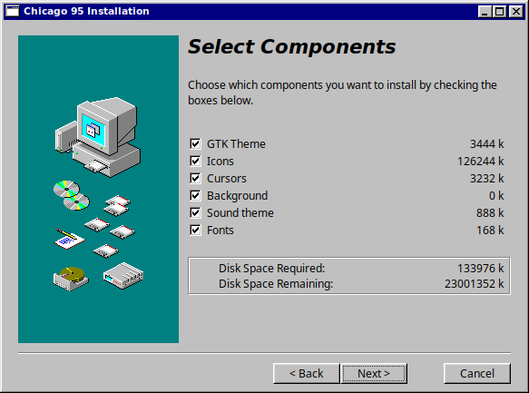
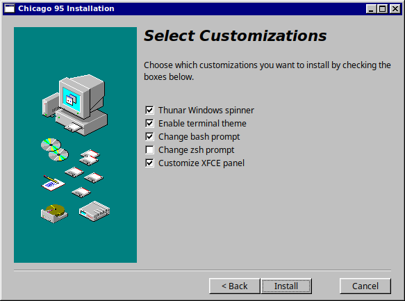
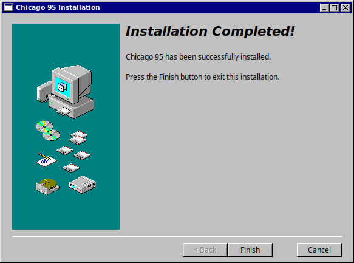

<a name="index"/>

# Index

<!--ts-->
* [Installing Chicago95](#install_theme)
    * [Single user automated install](#install_auto)
    * [Single user manual install](#install_single)
    * [System-wide manual install (optional)](#install_system)
* [Enabling The Theme](#config_theme)
* [Configuring The XFCE4 Panelbar](#xfce4_panel)
    * [Horizontal Panelbar](#horiz_panel)
    * [Vertical Panelbar](#vert_panel)
* [Start Buttons](#start_buttons)
* [Additional Enhancements](#add_enhance)
    * [GTK3 override configuration](#gtk3_override)
    * [Launcher Button icon scaling](#button_scale) (*For legacy GTK2 panelbars only*)
    * [Thunar status indicator](#thunar)
    * [QT5 theme configration with qt5ct](#config_qt5ct)
    * [GTK Overlay Scrollbars](#gtk_scroll)
    * [Desktop Shadow effects](#desktop_shadow)
    * [Desktop background color](#desktop_color)
    * [Desktop icon effects](#desktop_icons)
    * [Cursors](#cursors)
    * [MS Sans Serif font](#ms_sans_serif)
    * [Terminal fonts](#terminal_fonts)
    * [Terminal themes](#terminal_themes)
    * [Whisker Menu](#whiker_menu)
    * [Sound theme](#startup_sound)
* [HiDPI (experimental)](#hidpi)
* [Disabling GNOME Client Side Decorations](#nocsd)
* [Common issues](#common_issues)
<!--te-->

---
<a name="install_theme"/>

## Installing Chicago95


<a name="install_auto"/>

### [ Single user automated install ]

Chicago 95 comes with an automated installer. Run the `installer.py` python script to walk through a guided install of Chicago 95.

<p align="center">

</p>

Select components:
<p align="center">

</p>

Select customization options:
<p align="center">

</p>

Complete:
<p align="center">

</p>

<a name="install_single"/>

### [ Single user manual install ]

The following installation steps will require that you enable the `view hidden folders` option in your file manager to see hidden files.

#### Step 1: Prepare theme and icon directories

Create a `.themes` folder in your user directory `/home/$USER/` if it doesn't already exist. (with $USER being your username.)

    mkdir -p ~/.themes

Create a `.icons` folder in your user directory `/home/$USER/` if it doesn't already exist.

    mkdir -p ~/.icons

#### Step 2: Copy the Chicago95 GTK and icon themes

Copy the GTK theme from `Chicago95-master/Theme/` folder into `.themes`.

    cp -r Chicago95-master/Theme/Chicago95 ~/.themes

Copy the icon themes from `Chicago95-master/Icons/` folder into `.icons`.

    cp -r Chicago95-master/Icons/* ~/.icons

#### Step 3:

After copying the theme files into their appropriate places, you might need to log out then log back in for any changes to take places. Check out ["Enabling The Theme"](#config_theme) if you need help with setup.

<a name="install_system"/>

### [ System-wide manual install ] (optional)

The following installation steps will require that you enable the `view hidden folders` option in your file manager to see hidden files.

Copy the GTK theme from `Chicago95-master/Theme/` folder into `/usr/share/themes/`.

    sudo cp -r Chicago95-master/Theme/Chicago95 /usr/share/themes/

Copy the icon themes from `Chicago95-master/Icons/` folder into `/usr/share/icons/`.

    sudo cp -r Chicago95-master/Icons/* /usr/share/icons/

[[Return to Index]](#index)

---
<a name="config_theme"/>

## Enabling Chicago95

The following steps will guide you through enabling the theme and making additional configurations if desired.

#### Enabling the GTK theme
- Open the XFCE settings manager > Appearance.
- Choose Chicago95 as the theme style.

#### Enable the icon theme
- Open the XFCE settings manager > Appearance > Icons.
- Select Chicago95 or Chicago95-tux.

#### Enabling the Window Manager theme
- Open the XFCE settings manager > Window Manager.
- Choose Chicago95 as the theme style.
- Set Title font to Sans Bold, 8 points.

#### Enabling the notification theme
- Open the XFCE settings manager > Notifications.
- Choose Chicago95 for the theme.
- Adjust Opacity to 100%.

#### Enabling the theme for QT5 applications (optional)
For QT5 applications such as KeePassXC or q4-Wine, you can enable GTK theme support.  This can improve theme consistency across a range of applications.  Chicago95 on QT5 applications works quite well, however there might occasionally be a few small bugs; one example being scrollbox buttons missing their borders.

To begin setting this up install the qt5 style plugins package.

Debian based platforms:

    sudo apt install qt5-style-plugins

Arch based platforms:

    pacman -S qt5-styleplugins

After the installation is complete, relogin for changes to take place.

For further tuning of QT5 with the Chicago95 GTK theme, read [QT5 theme configration with qt5ct](#config_qt5ct)

[[Return to Index]](#index)

---
<a name="xfce4_panel"/>

## Configuring The XFCE4 Panelbar

The following steps will guide you through configuring the XFCE4 panelbar to resemble the taskbar seen in MS Windows 95. Some options seen in the following steps may not be present across all versions of the XFCE desktop environment and can vary between different Linux/Unix-like operating systems.

*The following steps are written from the perspective of XFCE4 Version 4.14.*

<a name="horiz_panel"/>

### Configuring a horizontal taskbar

Below outlines the manual process to set this all up. This process can be automated by running `xfce4-panel-profiles load Extras/Chicago95_Panel_Preferences.tar.bz2`. 

#### Step 1: Setting the panelbar size

- Open the XFCE settings manager > Panel
- From the Display tab set the panel mode to "Horizontal".
- Check "Lock Panel".
- Set "Automatically hide the panel" to "Never".
- Row Size (pixels): Can be at, or between, 24px to 32px; If your are using the 4.12 version of the XFCE panelbar, use even numbers for the row size since odd number row sizes will cause icon scaling issues for launcher buttons and status icons.
- Number of rows will be "1".
- Length will be 100%.

#### Step 2: Setting the panelbar appearance

- In the Appearance tab set the background style to "None (use system style)"
- Disable the icons setting "Adjust size automatically" (*this option is only available for the 4.14 version panelbar*)
- Set "Fixed Icon Size" to 16. (*this option is only available for the 4.14 version panelbar*)

*Note: For 4.12 version panelbar users, if you want to adjust the icon scaling of your launcher buttons to a 16px icon, see [Launcher button icon scaling](#button_scale)*

#### Step 3: Adding panelbar plugins

Open the XFCE settings manager > Panel > Items

Here's an organized list for the panel Items plugin layout.

1. Application Menu or Whisker Menu;
2. Separator (*Handle Style*);
3. Custom Launchers can go here to resemble the quick launch toolbar from Windows.;
4. “Show Desktop” plugin;
5. Separator (*Handle Style*);
6. Window Buttons (*Uncheck "Show flat buttons" and "Show Handle.;" Sorting Order: None; Window grouping: Never*);
7. Separator (*Transparent with Expanding enabled*);
8. Separator (*Handle Style*);
9. Indicator Plugin and Notification Area plugin (*16px max icon size preferred; also uncheck "Show frame"*);
10. Orage Panel Clock for XFCE 4.12 (not required for 4.14). (*Enable check box “Show frame” and replace the text in “Line 1” with %I:%M %p*)

<a name="vert_panel"/>

### Configuring a vertical taskbar

#### Step 1: Setting the panelbar size

- Open the XFCE settings manager > Panel
- From the Display tab set the panel mode to "Deskbar." (*The "vertical" option looks bad, this is why we'll go with deskbar.*)
- Check "Lock Panel."
- Set "Automatically hide the panel" to "Never."
- Row Size (pixels): Can be at, or between, 24px to 32px; If your are using the 4.12 version of the XFCE panelbar, use even numbers for the row size since odd number row sizes will cause icon scaling issues for launcher buttons and status icons.
- Number of rows can be 1 or 2. 2 looks nice if you want a wide panelbar.
- Length will be 100%.

#### Step 2: Setting the panelbar appearance

- In the Appearance tab set the background style to "None (use system style.)"
- Disable the icons setting "Adjust size automatically" (*this option is only available for the 4.14 version panelbar*)
- Set "Fixed Icon Size" to 16. (*this option is only available for the 4.14 version panelbar*)

*Note: For 4.12 panelbar users, if you want to adjust the icon scaling of your launcher buttons to a 16px icon, see [Launcher button icon scaling](#button_scale)*

#### Step 3: Adding panelbar plugins

Open the XFCE settings manager > Panel > Items

Here's an organized list for the panel Items plugin layout.

1. Application Menu or Whisker Menu; (*If you've set your panelbar row number to 1, then set the application / whisker menu button to display only the icon. If you've set your panelbar row number to 2, then set the application menu button to display only the title without the icon.*)
2. Separator (*Handle Style*);
3. Custom Launchers can go here to resemble the quick launch toolbar from Windows.;
4. “Show Desktop” plugin;
5. Separator (*Handle Style*);
6. Window Buttons (*Uncheck "Show button labels," "Show flat buttons," and "Show Handle;" Sorting Order: None; Window grouping: Never*);
7. Separator (*Transparent with Expanding enabled*);
8. Separator (*Handle Style*);
9. Indicator Plugin and Notification Area plugin (*16px max icon size preferred; also uncheck "Show frame"*);
10. If you set the panelbar row number to 1, you'll might want to go without a panelclock. Orage Panel Clock or the normal panel clock plugin will look nice. (*If using Orage, enable check box “Show frame” and replace the text in “Line 1” with %H:%M %p.*)

[[Return to Index]](#index)

---
<a name="start_buttons"/>

## Start Buttons

The following steps will guide you through setting up a MS Windows 95 themed "Start" button.

Something to keep in mind:

- The Whisker Menu plugin as of XFCE 4.13 is a GTK3 based application. Prior versions of the XFCE desktop utilized a GTK2 version.
- The Application Menu plugin as of XFCE4.14 is a GTK3 based application. Prior versions of the XFCE desktop utilized a GTK2 version.

*Note: Some distributions may implement older versions of the panelbar plugins, regardless of the XFCE desktop version.*

Open the XFCE settings manager > Panel > Items tab > Double click the Whisker / Application menu item in the item list; alternatively you can also access their settings menu by right clicking the icon from the panelbar and selecting "properties."

- In the Whisker / Application properties menu click the icon option (*This will appear as the icon badge on your start button that's currently in use.*)
- In the "Select An Icon" window, navigate to `/home/$USER/.themes/Chicago95/misc` (*with $USER being your username.*) You may have to click the pull-down menu from "Select icon from" and then select "Image Files" so that you can navigate to a custom icon on your filesystem. You may also have to enable the filechooser to display hidden files. (*Press Ctrl+h to toggle this setting.*)

`misc/` contains simple small icon badges in different sizes. You may have to experiment a little until you can find a size that fits correctly

....`misc/GTK2 start buttons/` contains start buttons that are used for the GTK2 version of the Whisker / Application Menu plugin.

....`misc/Legacy GTK3 start buttons/` contains start buttons that were used for an older GTK3 version of the Whisker / Application Menu plugin.

*Note: The smallest optimal panel row size for this theme is 24 pixels. If your panel is below that size, you will encounter icon scaling issues.*

[[Return to Index]](#index)

---
<a name="add_enhance"/>

## Additional Enhancements

This section of the guide contains additional enchancements that can be made to improve the theme. These are all optional and might require some advanced knowledge of operating your system.

<a name="gtk3_override"/>

### [ GTK3 override configuration ]

The GTK3 override configuration file can be used to make some additional minor enchantments to the theme. There are currently two versions of the configuration file that can be used.

For XFCE 4.12 desktops, copy the configuration file from `Chicago95-master/Extras/override/gtk-3.22/` into `/home/$USER/.config/gtk-3.0/`.

    cp Chicago95-master/Extras/override/gtk-3.22/gtk.css ~/.config/gtk-3.0/

For XFCE 4.14 desktops, copy the configuration file from `Chicago95-master/Extras/override/gtk-3.24/` into `/home/$USER/.config/gtk-3.0/`.

    cp Chicago95-master/Extras/override/gtk-3.24/gtk.css ~/.config/gtk-3.0/

*Note 1: You may have to create the "gtk-3.0" directory if it's not there.*

    mkdir -p ~/.config/gtk-3.0

*Note 2: If you ever want to change your system theme to anything else, don't forget to remove the `gtk.css` configuration file! It makes adjustments based on this theme which might break other themes.*


<a name="button_scale"/>

### [ Launcher button icon scaling ] (advanced)
(Note: This step shouldn't be neccesary for the XFCE 4.14 panelbar as-seen from XUbuntu 19.04. This only applies to the XFCE 4.12 version as-seen in XUbuntu 18.04.)

This might be a little complicated since it's more of a work-around than a good solution. I tried making this as simple as possible where you can just adjust configurations in a file. If there are questions or issues with the following instructions, open a ticket and I'll try to walk you through it.

If you want to force 16x16px icons in the launcher buttons, you can do this through the theme by editing the panel.rc file where there are commented options for icon scales.

- Open a text editor and navigate to `/home/$USER/.themes/Chicago95/gtk-2.0/panel.rc` (with $USER being your username.)
- Move to line 250 of the file where you will see a section specified for Launcher buttons.

Example steps: You will first need to determine your current panel bar row size since the launcher button icon padding is determined by the vertical size of the panel bar.

- Open the XFCE settings manager > Panel
- Verify the "Row Size (pixels)". (Lets say that it's 38 pixels for this example.)
- Return back to the text editor and locate the line comment that is specifying your panel bar row size. (38px height panel for this example is on line 284.)
- Delete the "#" pound comment character in front of the xthickness and the ythickness values for the specified panel bar size.
- Now Insert a "#" pound comment character in front of the xthickness and the ythickness values of the previous default selection, which is for a 24px height panel.
- Save the file and reload the xfce panel bar. You can run `xfce4-panel -r` in a terminal to reload the panel.

Note: Even numbered panel bar row sizes seem to work best. If your panel bar row size is "29px" for example, the launcher icons may not scale correctly.

If you use a vertical deskbar, you could add a second row from the panel properties menu to organize the launcher buttons into rows. This would have a more organized effect.

[[Return to Index]](#index)

<a name="thunar"/>

### [ Thunar status indicator ] (for XFCE 4.14)

The thunar status indicator can be modified on line 59 in `/home/$USER/.themes/Chicago95/gtk-3.24/apps/thunar.css`. Uncomment the code from line 53 to line 64.

You can replace `status_badge_c95.png` with four of the following images.

- `status_badge_c95.png`
- `status_badge_ie.png`
- `status_badge_msw.png`
- `status_badge_tux.png`
- `status_badge_xue.png`

[[Return to Index]](#index)

<a name="config_qt5ct"/>

### [ QT5 theme configration with qt5ct ] (advanced)

The following steps are written from the XUbuntu desktop. These will vary on other distributions.

You can use qt5ct for further modifying qt5 application themes to resemble the GTK theme. To set this up you can install qt5ct.

Debian based platforms:

    sudo apt install qt5ct

Arch based platforms:

    pacman -S qt5ct

After installing qt5ct you will have to configure an environment variable so that the QT platform theme calls on qt5ct and not GTK. Navigate to `/etc/X11/Xsession.d/` and search for a file named `56xfce4-qtconfig`. This may or may not be present depending on your distribution and it may be under a different name (for XUbuntu the file name is `56xubuntu-session.`) If this file is not present, then you could try adding `QT_QPA_PLATFORMTHEME=qt5ct` to the `/etc/environment` file.

- Open `/etc/X11/Xsession.d/56xubuntu-session` (or 56xfce4-qtconfig) in a text editor as root or sudo elevation.
- There will be a line with the following "# QT5 apps to use GTK style" and below that the variable `export QT_QPA_PLATFORMTHEME=gtk2`
- Change the variable to `export QT_QPA_PLATFORMTHEME=qt5ct` and save changes made.

Now lets copy the Chicago95 QT5 color palette.

- Copy the Qt colour scheme file from `Chicago95-master/Extras/Chicago95_qt.conf` to `/usr/share/qt5ct/colors`. If the directory path doesn't exist, them make it. (mkdir -p /usr/share/qt5ct/colors)
- Log out then log back in.

Once you are logged back into your desktop you can access `Qt5 Settings` (or run `qt5ct` from a terminal.)

- In the QT5 Settings window adjust the style dropdown to "Windows."
- For the Palette Color scheme adjust the setting to `Custom`
- From the Color scheme dropdown select Chicago95_qt. This will make the colour scheme match the Chicago95 theme.
- In the Icon Theme tab you can select the Chicago95 icon theme here.
- In the Fonts tab you can select the fonts to be used in QT applications. (Liberation Sans 8 for a general font looks nice.)
- Click "Apply" to apply adjustments and OK to finish.

[[Return to Index]](#index)

<a name="gtk_scroll"/>

### [ GTK Overlay Scrollbars ]
Note: You may have to enable `view hidden folders` in your file manager to see hidden files.

GTK Overlay Scrollbars can be disabled from the `.xsessionrc` file located in the `Chicago95-master/Extras/override` folder.

Copy the .xsessionrc file into your user directory `/home/$USER/` or append the contents if you already have a .xsessionrc file.

Log out then log back in.

<a name="desktop_shadow"/>

### [ Desktop Shadow effects ]
Disable shadows in compositing for an authentic appearance, or at the very least disable “show shadows under dock windows” to prevent dark shading from the panel bar overlapping onto maximized applications.

- Open the XFCE settings manager > Window Manager Tweaks > Compositor tab
- Uncheck "Show shadows under pupup windows."
- Uncheck "Show shadows under dock windows."
- Uncheck "Show shadows under regular windows."

If using the compton compositor, copy the `compton.conf` file inside the Extras folder to `~/.config/compton/compton.conf` (or for system-wide install, `/etc/xdg/compton.conf`).

<a name="desktop_color"/>

### [ Desktop background color ]
If you want to use the default Windows 95 gray instead of a background image, right click the desktop and select Desktop Settings.  On the Background tab, set "Color" to "Solid color", and for the first color picker set "Color name" to #008080.  Disable the background image by setting "Style" to "None".

<a name="desktop_icons"/>

### [ Desktop icon effects (text shadows and label backdrop ) ] (advanced)
Some options seen in the following steps may not be present across all versions of the XFCE desktop environment and can vary between different Linux/Unix-like operating systems. To find which version of xfdesktop you are running you can run `xfdesktop --version` from a terminal.

#### xfdesktop 4.12

If you want to change the icon label backdrop colour, text colours, or highlight colours you'll have to edit the gtkrc theme file located in `/home/$USER/.themes/Chicago95/gtk-2.0/`.

- Text shadows can be modified from lines 553 to 559. These are currently commented out with "#."
- Label backdrop colours can be modified on line numbers 565 to 570.
- You can use CSS colour properties. After any changes are made log out then log back in.

#### xfdesktop 4.14

If you want to change the icon label backdrop colour or text colours, you'll have to edit the `gtk.css` configuration file located in `/home/$USER/.themes/Chicago95/gtk-3.24/`.

- Label backdrop colours can be modified on line 105 for "xfd_icon_backdrop."
- Text color can be modified from line 106 for "xfd_icon_text."
- You can use CSS colour properties. After any changes are made, log out then log back in.

<a name="cursors"/>

### [ Cursors ]
To install the cursors theme copy the folders in `Cursors` to `/usr/share/icons` (for system-wide install) or `~/.icons` (for user only install.)

In XFCE select Settings -> Mouse and Touchpad. Click on 'Icons' and select one of:

* **Chicago95 Standard Cursors**: Original Windows 95 cursor theme
* **Chicago95 Standard Cursors Black**: Customized Windows 95 cursor theme in black
* **Chicago95 Animated Hourglass Cursors**: Original Windows 95 animated cursor theme
* **Chicago95_Cursor_White**: Original Chicago95 cursor theme (replaced by Standard Cursors)
* **Chicago95_Cursor_Black**: Original Chicago95 cursor black theme (replaced by Standard Cursors Black	)
* **Chicago95_Emerald**: A 3d cursor theme with some extra flair

*Note: If you copied the icons to `/usr/share/icons` you may have to log out or reboot your system before the cursor theme is available.*

#### Custom Cursor Themes

If these themes aren't enough and you'd like to personalize your icon theme download your cursors (from sites like http://cd.textfiles.com/winfiles/winfiles1/cursors.html) and replace the cursor in `<cursor theme>/build/95` or `<cursor theme>/build/xcursors` (note: this only works in the Standard/Animated Hourgladd Cursors folders). You don't need to worry about the extension, the build script will work with regular cursors `.cur`, animated cursors `.ani` and icons `.ico`. So long as the file name before the file extension is the same. After you've made your changes run the python script `cursor_gen.py` from within the build directory and your new theme will be created. To give your theme a custom name edit the `index.theme` file. Then rename the folder and copy it using the same directions above. 

<a name="ms_sans_serif"/>

### [ MS Sans Serif font ]
For an authentic Windows 95 feel, you can use the original MS Sans Serif font.  To do this, you will need a copy of both the "MS Sans Serif Regular" and "Microsoft Sans Serif Regular" fonts from the `C:\Windows\Fonts` directory of any modern Windows computer.  (The filenames for these fonts are `sserife.fon` and `micross.ttf` respectively)

After copying over the files to your system, we now need to convert the `sserife.fon` file to a TrueType font using FontForge.  (This step is optional; you can still use MS Sans Serif, but bold fonts will not be available)

- Install FontForge with `sudo apt install fontforge` (For Arch platforms, run `pacman -S fontforge-git`)
- Open FontForge and open the `sserife.fon` file
- After the font is opened, go to File -> Generate Fonts...
- Below the new filename `MSSansSerif.ttf` there will be two dropdowns, make sure the left one is set to "No Outline Font", then set the right one to "(faked) MS Bitmap only sfnt (ttf)"
- Click the Generate button.  You may now close FontForge and delete the original `sserife.fon` file

We now need to install the MS Sans Serif fonts, as well as their font configuration files.

#### Single-user install: ####
- Run `mkdir -p ~/.fonts/truetype/ms_sans_serif/`
- Copy `micross.ttf` and `MSSansSerif.ttf` to `~/.fonts/truetype/ms_sans_serif/`
- Run `mkdir -p ~/.config/fontconfig/conf.d/`
- Copy `Extras/99-ms-sans-serif.conf` and `Extras/99-ms-sans-serif-bold.conf` to `~/.config/fontconfig/conf.d/`
- Update the font cache by running `sudo fc-cache -f -v`

#### System-wide install: ####
- Run `sudo mkdir -p /usr/share/fonts/truetype/ms_sans_serif`
- Copy `micross.ttf` and `MSSansSerif.ttf` to `/usr/share/fonts/truetype/ms_sans_serif`
- Verify that file permissions are set to -rw-r--r-- `sudo chmod 644 /usr/share/fonts/truetype/ms_sans_serif/*`
- Copy `Extras/99-ms-sans-serif.conf` and `Extras/99-ms-sans-serif-bold.conf` to `/etc/fonts/conf.d`
- Update the font cache by running `sudo fc-cache -f -v`

#### Enabling the font: ####
- Open the XFCE settings manager > Appearance > Fonts tab.
- Set the "Default font" to "Microsoft Sans Serif Regular" size 8.
- Open the XFCE settings manager > Window Manager.
- Set the "Title font" to Microsoft Sans Serif Bold" size 8.
- For XFCE 4.12 users, you can set the font for the Orage panel clock by right-clicking the panel clock, selecting Properties, then next to Line 1, change the font to Microsoft Sans Serif, style Regular, size 8.  Inside the Line 1 box, add two spaces before and after the value in the box, to apply some spacing.

[[Return to Index]](#index)

<a name="terminal_fonts"/>

### [ Bash terminal Fonts ]
Copy the folder `Fonts/vga_font` to `~/.fonts/truetype/` if the `.fonts/truetype` folder doesn't exist just create it before you copy the files.

Update your font cache: `fc-cache -f -v`

In xfce4-term go to the Edit->Preferences and click on the Appearance tab and select the font `Less Perfect DOS VGA` or `More Pefect DOS VGA`, size 12.  For better readability, uncheck "Allow bold text".

If desired, you can use an MS-DOS style cursor by going to the General tab, setting "Cursor shape" to "Underline" and checking the box for "Cursor blinks".

[Click here](https://int10h.org/oldschool-pc-fonts/fontlist/) for more classic fonts.

<a name="terminal_themes"/>

### [ Terminal themes ]

#### Bash terminal MS-DOS theme

Copy the file `Extras/Chicago95.theme` to `~/.local/share/xfce4/terminal/colorschemes` (create the colorschemes folder if it doesn't exist: `mkdir -p ~/.local/share/xfce4/terminal/colorschemes`).
Under preferences in xfce-term select 'Colors.' Under `Presets` you should see `Chicago95`.

To get the MS-DOS `C:\>` prompt and startup message add the contents of `Extras/DOSrc` to your `.bashrc` file: `cat Extras/DOSrc >> ~/.bashrc`.
To get MS-DOS Prompt title, go to the Preferences prompt and change title to MS-DOS Prompt and select isn't displayed on The Dynamically-Set Title

#### oh-my-zsh MS-DOS theme

Copy the file `Extras/Chicago95.zsh-theme` to `~/.oh-my-zsh/themes` (if you have changed your `.oh-my-zsh` config location, put the theme in that folder). In your `.zshrc` change your theme to Chicago95.

This will add the MS-DOS prompt. You will get a C prompt by default. If the previous command had an exit code other than 0 you will get an F prompt. If you are in a git repository you will git a G prompt, followed by the branch (in yellow) and the status (clean in green, dirty in red).

To get the startup message, add the contents of `Extras/ZSHDOSrc` to your `.zshrc` file: `cat Extras/ZSHDOSrc >> ~/.zshrc`.

[[Return to Index]](#index)


<a name="whiker_menu"/>

#### [ Whisker Menu Side Bar Theme ]

Whisker menu comes with the *Windows 95* side bar. You can change this by editing the file `~/.themes/Chicago95/gtk-3.24/apps/whiskermenu.css`

Find the line `background-image: url("../assets/branding_w95-orig.png");` comment it by placing `/*` and `*/` around it and uncomment one of the other lines:

* branding_w95-orig.png: the original from the boss
* branding_w95.png: Replicated version of the origina in a higher resolution
* branding_l95.png: A linux version
* branding_C95.png: Branded version of this theme

If none of these catch your fancy edit `~/.themes/Chicago95/misc/whisker-sidebar.svg` in Inkscape, export as PNG and replace `branding_w95-orig.png`

[[Return to Index]](#index)

<a name="startup_sound"/>

### [ Windows 95 sounds ]
First, ensure that SoX and gtk canberra are is installed by running: `sudo apt-get install gnome-session-canberra sox libcanberra-gtk3-module libcanberra-gtk-module`

If it doesn't exist create the directory sounds in `.local/share/`: `mkdir -p ~/.local/share/sounds`

Copy the folder `sounds/Chicago95` to `~/.local/share/sounds`

#### XFCE

Open Settings > Appearance and click on tab Settings

Make sure both Event Sounds are enabled (checked):

* Enable event sounds
* Enable inputt feedback sounds

Set the new sound theme using xfconf-query: `xfconf-query -c xsettings -p /Net/SoundThemeName -s Chicago95`

#### Startup Sound

If the startup sound isn't working follow these instructions

For startup, copy the file `Extras/Microsoft Windows 95 Startup Sound.ogg` to `/home/$USER/.themes/Chicago95/misc/Microsoft Windows 95 Startup Sound.ogg` or where ever you want.

#### XFCE
- Open XFCE Settings Manager > Session and Startup > Application Autostart tab
- Add a new entry
- Give it a name and a command similar to the following: `play /home/$USER/.themes/Chicago95/misc/Microsoft\ Windows\ 95\ Startup\ Sound.ogg`

#### LXDE
- Create the file `./config/autostart/chicago95.desktop` with the following contents:

```
[Desktop Entry]
Type=Application
Name=Chicago95 Chime
Comment=The Windows 95 startup sound
Exec=sh -c 'play /home/$HOME/.themes/Chicago95/misc/Microsoft\ Windows\ 95\ Startup\ Sound.ogg'
OnlyShowIn=LXDE
```

[[Return to Index]](#index)

---
<a name="hidpi"/>

## HiDPI

There is only partial HiDPI support but it works pretty well

#### Appearance settings

- Increase DPI from 96 to 192
- *(Optional)* Increase default font from Sans 8 to Sans 9

#### Replace xfwm4 theme with HiDPI version

Use HiDPI theme

    mv ~/.themes/Chicago95/xfwm4 ~/.themes/Chicago95/xfwm4_lodpi
    mv ~/.themes/Chicago95/xfwm4_hidpi ~/.themes/Chicago95/xfwm4

#### Replace configs with HiDPI version

Make GTK2 buttons bigger

    sed -i 's/#include "button.rc"/include "button.rc"/' ~/.themes/Chicago95/gtk-2.0/gtkrc

Increase taskbar size

    cp ~/.gtkrc-2.0 ~/.gtkrc-2.0.bak
    cp Chicago95-master/Extras/hidpi/.gtkrc-2.0 ~/.gtkrc-2.0

#### Adjust settings for HiDPI

Set GDK scale to 2x

    echo 'export GDK_SCALE=2' >> ~/.profile
    echo 'export GDK_DPI_SCALE=0.5' >> ~/.profile

Make GTK icons bigger

    xfconf-query -c xsettings -p /Gtk/IconSizes -s "gtk-large-toolbar=32,32:gtk-small-toolbar=24,24:gtk-menu=32,32:gtk-dialog=88,88:gtk-button=32,32:gtk-dnd=32,32"

Increase icon size in Thunar File Manager

    xfconf-query -c thunar -p /shortcuts-icon-size -s "THUNAR_ICON_SIZE_SMALL"
    xfconf-query -c thunar -p /tree-icon-size -s "THUNAR_ICON_SIZE_SMALLER"

Inqt5ctcrease icon size on desktop

    xfconf-query -c xfce4-desktop -p /desktop-icons/icon-size -s 64

#### Cursor theme

The cursors in the theme do not support HiDPI but [Hackneyed](https://www.gnome-look.org/p/999998/startdownload?file_id=1549578280&file_name=Hackneyed-48px-0.7.2-right-handed.tar.bz2&file_type=application/x-bzip2&file_size=49921) is a good alternative. Download and extract to `~/.icons` and select it in Mouse settings.

#### Panelbar tweaks

- Set panel row size to 48
- Application Menu: Check show button title and set it to 𝗦𝘁𝗮𝗿𝘁 (copy+paste)
- Notification Area: Set maximum icon size to 44
- Status Notifier Plugin: Set maximum icon size to 22
- *(Optional)* Orage Panel Clock: Set width to 144 and font to Sans 9

[[Return to Index]](#index)

---
<a name="nocsd"/>

## Disabling GNOME Client Side Decorations

### Step 1:

To disable client side decorations for XFCE 4.16 applications, you can install the the [libxfce4ui-nocsd](https://github.com/Xfce-Classic/libxfce4ui-nocsd) fork. *(Note: This library primarily affects XFCE applications.)*

For XUbuntu 21.04 users specifically:

    sudo apt install libxfce4ui-nocsd-2-0

For Arch based platforms:

    pacman -S libxfce4ui-nocsd

For other platforms, such as Debian 11 or non XUbuntu 21.04 flavours, you may have to build libxfce4ui-nocsd for yourself. You may also check the [Chicago95 OBS repo](https://software.opensuse.org//download.html?project=home%3Abgstack15%3AChicago95&package=chicago95-theme-all) to see if your platform is available.

### Step 2:

Open the XFCE Settings Editor > xsettings > DialogsUseHeader (remove check). Alternatively, you can also perform this action from the following terminal command.

    xfconf-query -c xsettings -p /Gtk/DialogsUseHeader -s false

### Optional Step 3:

If you would like to return the titlebar and window manager borders for most other GTK3+ applications, you can also install the gtk3-nocsd package.

Debian based platforms:

    sudo apt install gtk3-nocsd.

Arch based platforms:

    pacman -S gtk3-nocsd-git

### Optional Step 4:

After installing the gtk3-nocsd package, you may need to reboot your computer. The Chicago95 GTK theme includes an optional gtk3-nocsd theme to mask the header bars into simple toolbar buttons. To enable the gtk3-nocsd theme, follow the bellow steps:

- Navigate to the location you've installed Chicago95. From there, navigate further more to gtk-3.0 > gtk.css.
- Scroll to the bottom of the gtk.css file. There are two comments stating, "Comment out for gtk3-nocsd theme" and two more comments stating, "Uncomment for gtk3-nocsd theme." Do so for the specified lines.
- You can comment out a line C style seen in the below example.

    /\* Commented gibberish \*/

- Log out then log back in. You can see the affect if you open the application Software centre as an example.

[[Return to Index]](#index)

---
<a name="common_issues"/>

## Common issues

"I've installed the theme, but the colours look wrong."

- This can occur if a GTK3 theme override is configured in  `~/.config/gtk-3.0/`. 
- From a file-manager or terminal, navigate to `~/.config/gtk-3.0/` (Press Ctrl-h to display hidden files & directories.)
- You should see a file by the name of `gtk.css`. Rename that file to gtk_bak.css, then log out and log back in.
- Optionally, there's also a gtk.css file provided by Chicago95 which you can copy into your `~/.config/gtk-3.0/` directory. For instructions on this, checkout [GTK3 override configuration](#gtk3_override).

"Themeing looks completely broken and unusable, especially for GTK3 applications. Windows are black and buttons are not visible."

- This can occur for Linux/Unix-like operating systems that don't support the required versions of GTK3. This theme requires GTK3.22 or GTK3.24. Chicago95 is also primarily an XFCE theme. There is also minimal support for Cinnamon and MATE desktop environments too.
- There is a forked version of the theme for legacy GTK3 support targetting GTK3.18 (as seen in XUbuntu 16.04.) You can check it out [here.](https://github.com/EMH-Mark-I/Chicago95-Custom-XUbuntu-16.04-)

"Some applications are missing the box arround their scrollbar buttons or missing scrollbar buttons altogether; they might display only an arrow or nothing at all."

- Missing scrollbar buttons can be observed in QT based applications such as KeePassXC or q4Wine. There is currently no resolution for this issue.
- Some applications may forcefully override the desktop theme and disable scrollbar buttons. This can be observed in the Cinnamon Brisk menu as an example. There is currently no resolution for this issue.

"My scrollbar is missing or will momentarily appear then disappear."

- Don't forget to checkout the instructions for disabling the [GTK Overlay Scrollbars](#gtk_scroll).
- Some applications might override the theme or employee their own scrollbar from outside the scope of the desktop toolkit. This has been observed in a few applications, namely Firefox; in this case, there is currently no resolution for this issue.

[[Return to Index]](#index)
