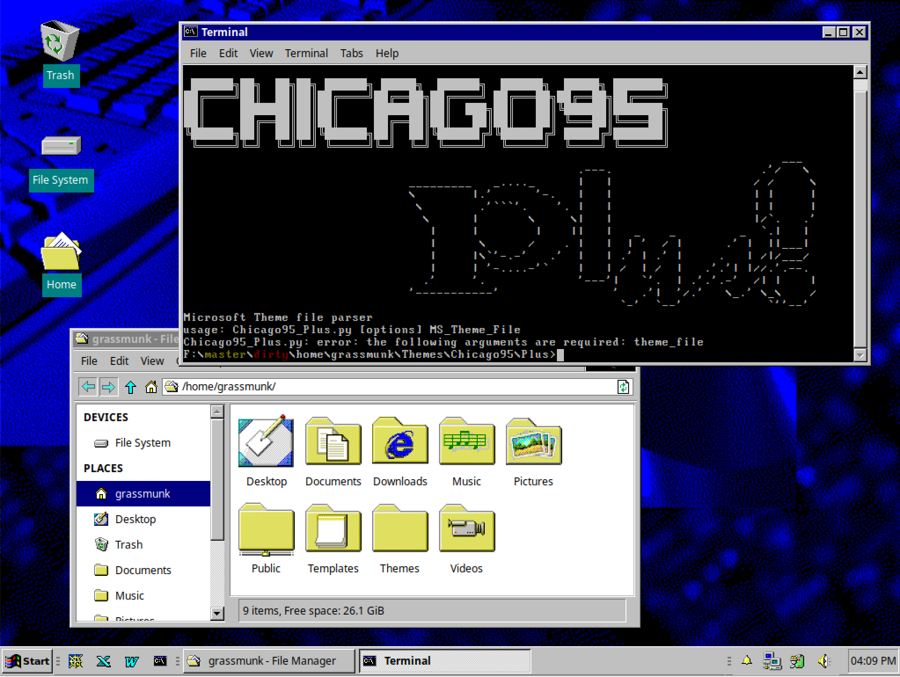
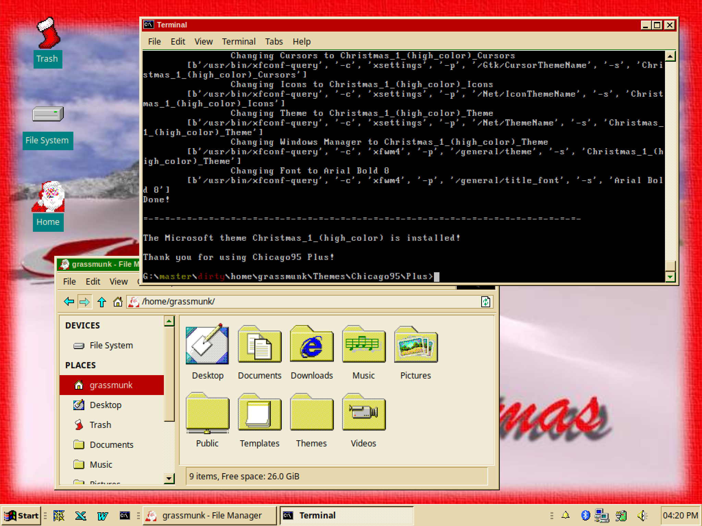
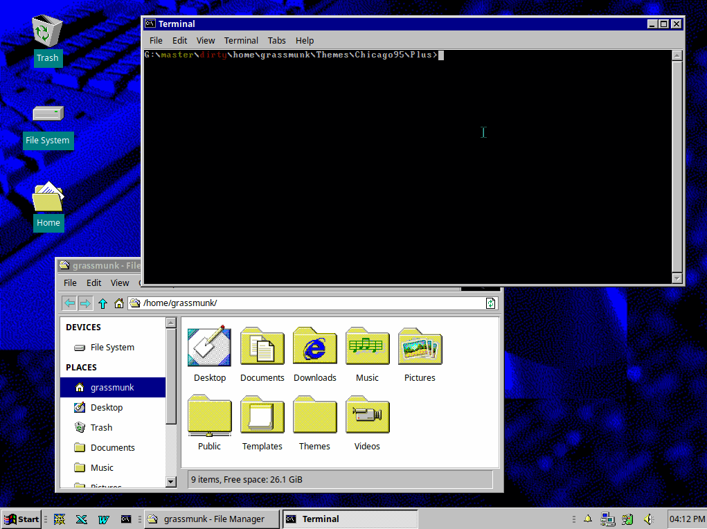
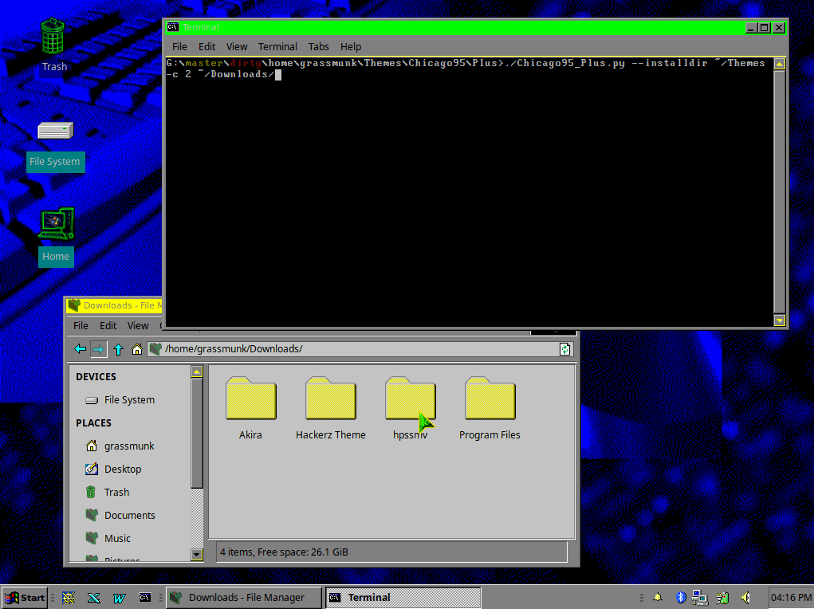

# Chicago95 Plus!
#### Windows Plus! Theme Conversion for XFCE/Chicago95

Is Chicago95 not authentic enough for you? Do you want to use Windows Plus! themes to personalize your Chicago95 experience? Well look no further!

Download any `.theme` file from the web, point `Chicago95_plus.py` at it and it will generate a wholy new theme for you to install. 

Change Chicago95 from this:



to this!



Currently supports:

* Icons
* Cursors
* Theme colors
* Fonts
* Wallpapers (installed to `/home/$USER/Pictures`)

Sounds are copied to the output folder and named but arent installed yet. 

By default Chicago95 Plus! creates the theme in your working folder and copies the files to their required location then automatically changes the current theme to the new theme, just like Windows!

If you want to get more out Chicago95 Plus! it supports multiple options:

* `--installdir DIRECTORY` generates the new theme files and outputs them to DIRECTORY
* `--noinstall` generates the theme files but does not move them or run the commands to switch the theme
* `--info` Gives verbose information about the theme file, does not do any conversion
* `--verbose`/`--debug` gives more/way more information about what is happening
* `--colors`/`--squaresize`/`--overlap` controls the way Icon files are converted to svg

Detailed Help output:

```
Microsoft Theme file parser
usage: Chicago95_Plus.py [options] MS_Theme_File

Chicago95 Plus! is a python script that can parse Windows 95/98/ME/XP theme
files and create new Chicago95 themes. Chicago95 Plus! supports Icons,
Cursors, Fonts, Wallpapers and Theme colors! Use this against themes you can
find on ThemeWorld or any site that have Windows Plus! Themes! This script can
be called from any folder, execute it and provide it the path to a theme file
(e.g. Chicago95_Plus.py /home/bgates/Wicked/Wicked.theme) and your new theme
will be created!

positional arguments:
  theme_file            Microsoft Windows 95/98/ME .theme file

optional arguments:
  -h, --help            show this help message and exit
  -d, --debug           Print lots of debugging statements (default: 30)
  -v, --verbose         Be verbose (default: None)
  --noinstall           Do not place folders nor change theme (default: False)
  --info                Does nothing except give information about the theme
                        file (default: False)
  -c COLORS, --colors COLORS
                        How many colors before skipping Inkscape fix/merge for
                        SVGs. Set to 1 to speed up conversion. WARNING: This
                        may result in transparent icons! (default: 32)
  -o OVERLAP, --overlap OVERLAP
                        Pixel overlap for SVG icons (default: 1)
  -s SQUARESIZE, --squaresize SQUARESIZE
                        Square size for SVG icons (default: 20)
  --installdir INSTALLDIR
                        Folder to create new theme in, default is current
                        working directory (default:
                        /home/grassmunk/Themes/Chicago95/Plus)

Part of the Chicago95 theme project
```

Here are two examples running Chicago95 Plus! to change the theme:

Changing themes:





