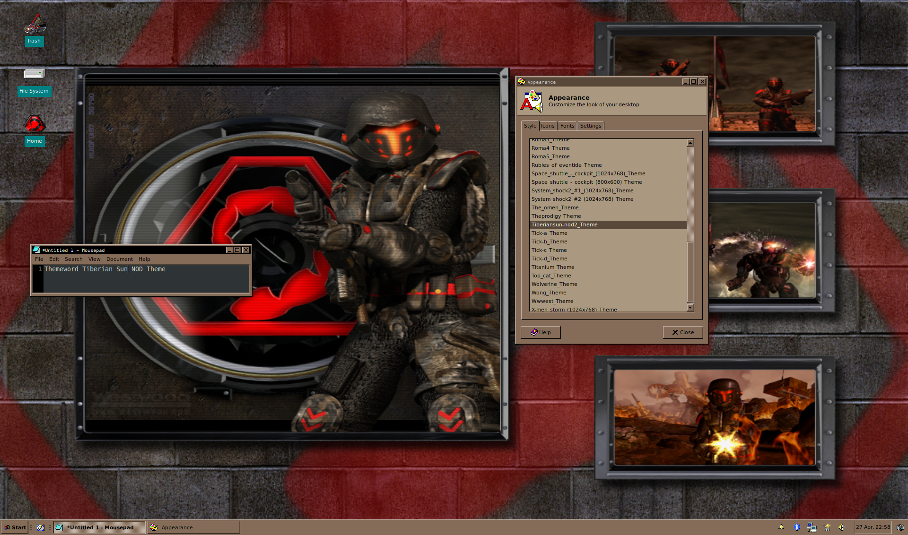
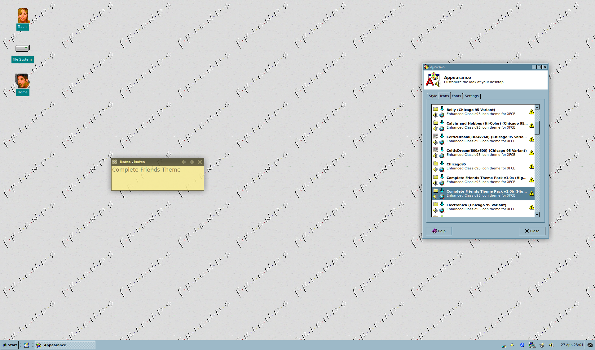

# Chicago95 Plus!
#### Windows Plus! Theme Conversion for XFCE/Chicago95

Is Chicago95 not authentic enough for you? Do you want to use Microsoft Plus! themes to personalize your Chicago95 experience? Well look no further!

Download any Windows 95, 98, ME or XP theme file (from places like themeworld.com or archive.org) and use this tool to switch to your new theme!

Currently supports:

* Icons (ICL, DLL and ICO files)
* Cursors (CUR and ANI files)
* Theme colors
* Fonts
* Sounds
* Wallpapers (installed to `/home/$USER/Pictures`)

Sounds are installed assuming you have XFCE sounds enabled per the Chicago95 Install instructions.

To use Chicago95 Plus! on Xubuntu you need to install the following: `python3-svgwrite` `python3-fonttools` `inkscape`: `sudo apt install python3-svgwrite python3-fonttools inkscape`

By default Chicago95 Plus! creates the theme in your working folder and copies the files to their required location then automatically changes the current theme to the new theme, just like Windows!

If you want to get more out Chicago95 Plus! it supports multiple options:

* `--installdir DIRECTORY` generates the new theme files and outputs them to DIRECTORY
* `--noinstall` generates the theme files but does not move them or run the commands to enable the theme
* `--info` Gives verbose information about the theme file, does not do any conversion
* `--verbose`/`--debug` gives more/way more information about what is happening
* `--colors`/`--squaresize`/`--overlap` controls the way Icon files are converted to svg

Detailed Help output:

```
usage: ChicagoPlus.py [options] MS_Theme_File

Chicago95 Plus! is a python script that can parse Windows 95/98/ME/XP theme
files and create new Chicago95 themes. Chicago95 Plus! supports Icons,
Cursors, Fonts, Wallpapers, Sounds and Theme colors! Use this against themes
you can find on ThemeWorld or any site that have Microsoft Plus! Themes! This
script can be called from any folder, execute it and provide it the path to a
theme file (e.g. ChicagoPlus.py /home/bgates/Wicked/Wicked.theme) and your new
theme will be created!

positional arguments:
  theme_file            Microsoft Windows 95/98/ME .theme file

optional arguments:
  -h, --help            show this help message and exit
  -d, --debug           Print lots of debugging statements (default: 30)
  -v, --verbose         Be verbose (default: None)
  --noinstall           Do not place folders nor change theme (default: False)
  --info                Prints the json conversion of the theme file (default:
                        False)
  -c COLORS, --colors COLORS
                        How many colors before skipping Inkscape fix/merge for
                        SVGs. Set to 1 to speed up conversion. WARNING: This
                        may result in transparent icons! (default: 32)
  -o OVERLAP, --overlap OVERLAP
                        Pixel overlap for SVG icons (default: 1)
  -s SQUARESIZE, --squaresize SQUARESIZE
                        Square size for SVG icons (default: 20)
  --cursorfolder CURSORFOLDER
                        Chicago95 cursor folder to convert to new theme
                        (default: /home/phil/.icons/Chicago95_Cursor_Black)
  --themefolder THEMEFOLDER
                        Chicago95 theme folder to convert to new theme
                        (default: /home/phil/.themes/Chicago95)
  --iconsfolder ICONSFOLDER
                        Chicago95 icons folder to convert to new theme
                        (default: /home/phil/.icons/Chicago95)
  --installdir INSTALLDIR
                        Folder to create new theme in, default is current
                        working directory (default: /home/phil/PlusGTK)
  --logfile LOGFILE     Filename for debug logging (default:
                        chicago95_plus.log)

Specific Installs:
  --nocursors           Do not generate/install/enable the cursors (default:
                        True)
  --noicons             Do not generate/install/enable the icons (default:
                        True)
  --nowallpaper         Do not generate/install/enable the wallpaper (default:
                        True)
  --nosounds            Do not generate/install/enable the sounds (default:
                        True)
  --nocolors            Do not generate/install/enable the colors (default:
                        True)
  --nofonts             Do not generate/install/enable the fonts (default:
                        True)
  --noscreensaver       Do not generate/install the screensaver (default:
                        True)

Part of the Chicago95 theme project

```

Here are two examples of themes built using Chicago95 Plus!





