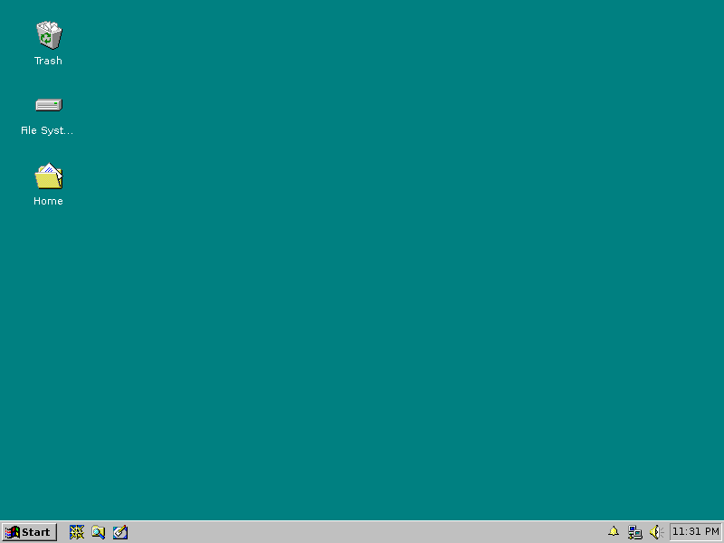

# Chicago95
#### XFCE / Xubuntu Windows 95 Total Conversion

*Click [here](Screenshots/SCREENSHOTS.md) for more screenshots*

I was unhappy with the various XFCE/GTK2/GTK3 Windows 95 based themes and decided to make one that was more consistent across the board for theming.

#### Included in this theme:

- New icons to complete the icon theme started with Classic95
- GTK2 and GTK3 themes
- Edited Redmond XFWM theme to more accurately reflect Windows 95
- Chicago95 Plus! A tool to preview and install Windows 95/98/ME/XP themes
- Plymouth theme created from scratch
- An MS-DOS inspired theme for oh-my-zsh
- Partial support for HiDPI monitors

#### Requirements

GTK+ 3.22 or 3.24

Xfce 4.12 or 4.14

gtk2-engines-pixbuf

A Window compositor

(If your are using an older desktop that uses GTK3.18, you can use [this forked version of the theme.](https://github.com/EMH-Mark-I/Chicago95-Custom-XUbuntu-16.04-))

-----

## Documentation

[Click here](INSTALL.md) for Chicago95 documentation and extra features.

-----

## Installation

### Packages

|Distro|Package Name/Link|
|:----:|:----:|
| Debian 9 | [obs-repo] |
| Debian 10 | [obs-repo] |
| Debian Testing/Unstable | [obs-repo] |
| Ubuntu 18.04 - 20.04 | [obs-repo] |

### Manual Installation
[Click here](INSTALL.md) for install steps.

### Install a Microsoft Windows Plus! theme
[Click here](Plus/README.MD) for installing custom themes.

### Install the Plymouth boot splash theme
[Click here](Plymouth/) for install steps.

## KDE Support (experimental)
- SDDM Logon Manager:: Click `Install from file...` in Loggin Screen (SDDM) manager. Select `SDDM/Chicago95.tar.gz` to install the theme. 
- Splash Screen: `plasmapkg2 -t lookandfeel -i KDE/Splash/chicago95.splashscreen`

### Screenshots
[Click here to view screenshots](Screenshots/SCREENSHOTS.md)

### Code and license
License: GPL-3.0+/MIT

[obs-repo]: https://software.opensuse.org//download.html?project=home%3Abgstack15%3AChicago95&package=chicago95-theme-all
