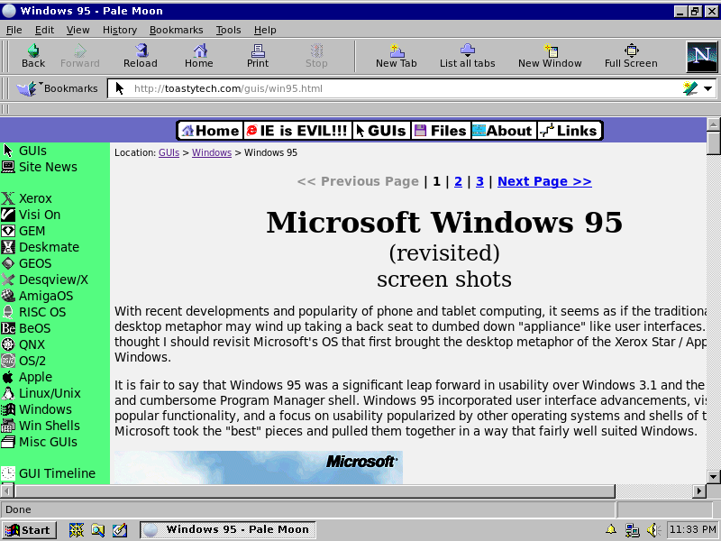
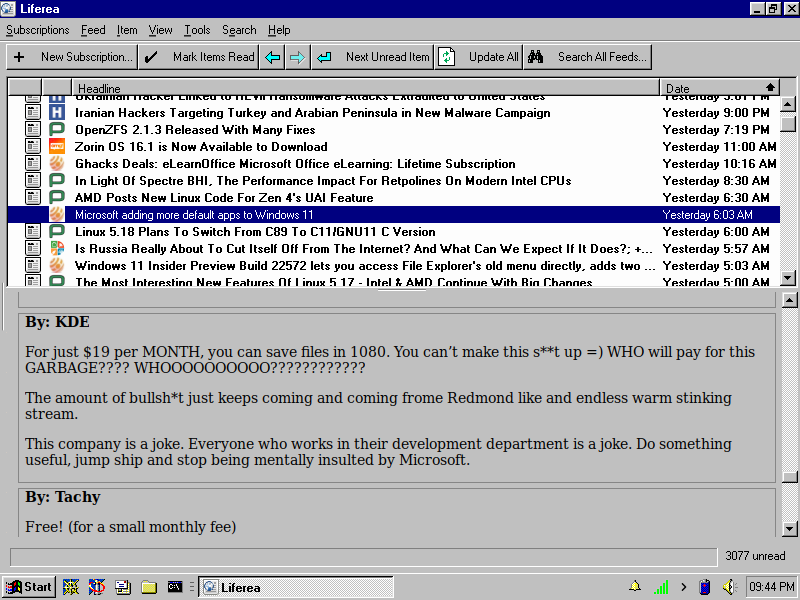
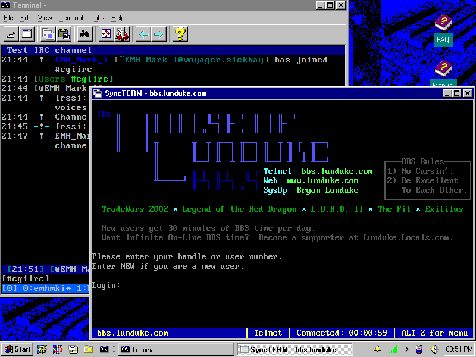
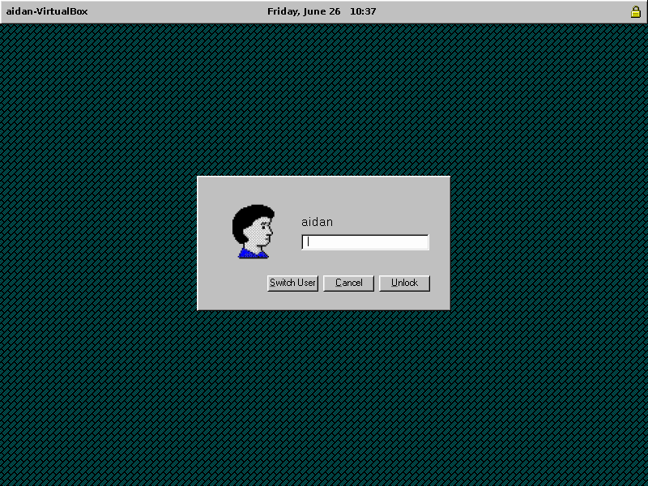

## Screenshots

#### Windows 95 Plymouth boot screen

#### RetroTux Plymouth boot screen

#### Desktop screenshots

#### XFCE4 Screensaver lock screen

#### LightDM login manager theme

#### LightDM login manager webkit theme

